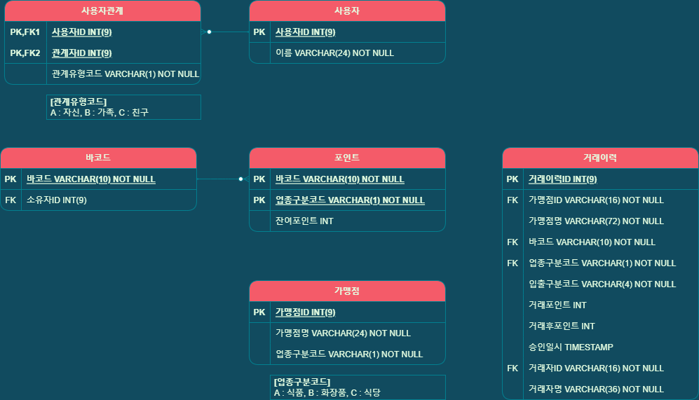

<h1>Kakao Pay Memebership 관리 프로젝트</h1>

<h3>1. 바코드 발급</h3>
<li>회원당 1개의 바코드 발급</li>
<li>기본적으로 해당 가맹점의 포인트 적립과 사용을 관리한다.</li>

<h3>2. 가족및 친구들간 바코드 공유</h3>
<li>바코드 사용을 공유할 수 있는 유저 그룹이 존재한다.</li>

<h3>3. 바코드를 이용한 포인트 적립</h3>
<li>바코드를 이용한 포인트 적립</li>
<li>가족 및 친구들의 동시 적용이 가능 하다.</li>

<h3>4. 바코드를 이용한 포인트 사용</h3>
<li>회원당 1개의 바코드 발급</li>
<li>가족 및 친구들의 동시 사용이 가능 하다.</li>

<h3>5. 가맹점간 포인트사용</h3>
<li>적립된 포인트는 가맹점의 업종 유형에 따라 포인트 공유 사용이 가능하다.</li>

<h2>주요개발내용</h2>
1. Redis 캐시를 이용하여 반복호출 되는 DBIO는 캐싱처리하여 응답 속도를 높인다.
2. 다수의 컨테이너가 동시 접속되는 환경에서 데이터 일관성을 유지하기 위하여, 포인트 적립 및 이용시에 테이블 ROW LOCK 을 설정하여 동시 접근을 차단한다. 
3. [ERD] 바코드 발급 이후 가족 및 친구들간의 공유 사용을 위하여 관계 테이블을 작성하여 관리한다.
4. [ERD] 이력테이블은 다량의 데이터 조회를 위하여 반정규화 하여 적재시킨다.

<h2>개발환경</h2>
<li>Java 11 LTS</li>
<li>Gradle</li>
<li>Redis 7.0.5</li>
<li>PostgresQL 1.14</li>
<li>Spring Boot 2.7.0</li>

<h3> 사전 설치 </h3>
<h4>REDIS</h4>
    <ol>docker image pull redis</ol>
    <ol>port:6379</ol>
    
<h4>POSTGRESQL</h4>
    <ol>docker pull postgres:14.1</ol>
    <ol>docker run -p 5432:5432 -e POSTGRES_PASSWORD = password
-e POSTGRES_DB = kakaopay --name postgres-kakaopay -d postgres</ol>

<h2>Reference</h2>

<li>ERD : /document/kakaopay-membership.png </li>
<li>Sample Data : /resources/data.sql </li>